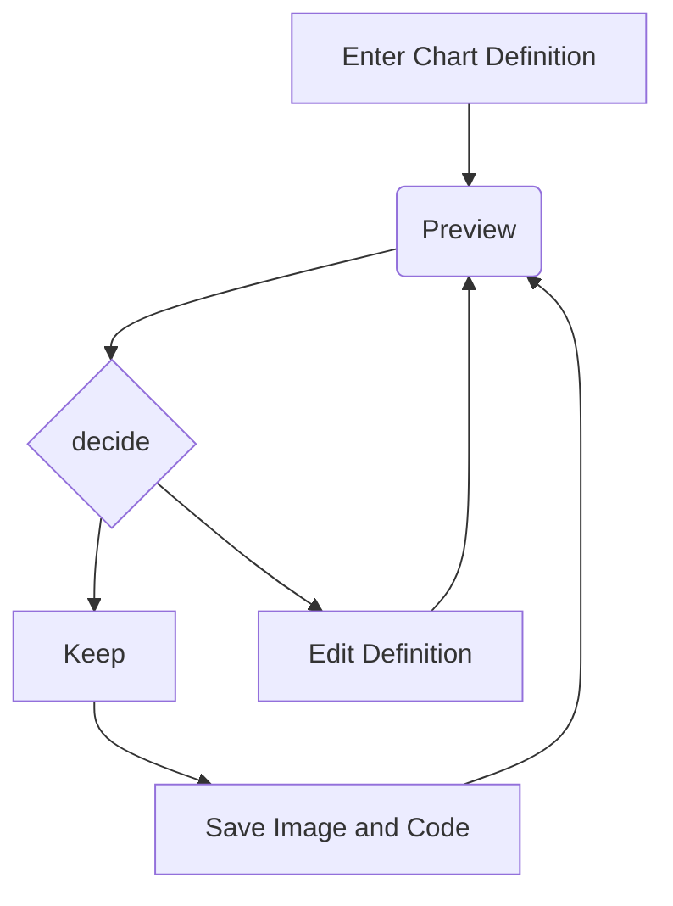

# Advanced examples

---

## Resizing images

You can specify the exact height and width using some HTML magic. Very handy if the image is too large or too small.

  

---

<!-- .slide: data-background-image="./img/1920x1080-transparent.png" data-background-size="contain" data-background-repeat="no-repeat" -->

-   The HTML width/height sizes are relative to those specified in the `reveal.json` file.
    -   These sizes are called the canvas sizes
    -   In this example: `1920x1080`.
    -   E.g.
        -   an `img` with width `960` will take 50% of the width.
        -   an `img` with height `540` will take 50% of the height.
    -   When the browser is resized, Reveal.js wil take care of the scaling so you don't have to. You just do everything relative to the resolution set in `reveal.json`.

---

## Video

<iframe width="550" height="550" data-src="https://www.youtube.com/embed/sGF6bOi1NfA" allowfullscreen></iframe>

---

## Website

Anything that allows you to embed a website, you can use too:

<iframe
    src="https://www.google.com/maps/embed?pb=!1m28!1m12!1m3!1d5018.051311095338!2d3.700269598821751!3d51.03414688375593!2m3!1f0!2f0!3f0!3m2!1i1024!2i768!4f13.1!4m13!3e6!4m5!1s0x47c373dfecba42a1%3A0x967548ec6ae567f6!2sGent%20Sint%20Pieters%20Station%2C%20Koningin%20Maria%20Hendrikaplein%2C%20Ghent!3m2!1d51.036234!2d3.7108572!4m5!1s0x47c373d974e7039b%3A0x2b5e1bf81b807f8c!2sHOGENT%20campus%20Schoonmeersen%2C%20Valentin%20Vaerwyckweg%201%2C%209000%20Gent!3m2!1d51.0330995!2d3.7030491999999997!5e0!3m2!1sen!2sbe!4v1697794155393!5m2!1sen!2sbe"
    width="1500"
    height="550"
    loading="lazy"
    referrerpolicy="no-referrer-when-downgrade">
</iframe>

You can scroll, zoom in/out, ... .

---

Not all websites allow this unfortunately, so be sure to test it out in advance!

<iframe width="550" height="550" data-src="https://github.com"></iframe> <iframe width="550" height="550" data-src="https://frankdeboosere.be/"></iframe>

_Tip: some websites capture the keyboard, causing the arrow keys (or others) to not work anymore. E.g. cookie banners etc. ._

---

## Mermaid Graphs

You can use [Mermaid](https://mermaid.js.org/intro/) graphs:



This is done by the [Reveal.js Mermaid](https://github.com/zjffun/reveal.js-mermaid-plugin) plugin.

---

## PlantUML Graphs

You can also use [PlantUML](https://plantuml.com/) graphs:

```language-plantuml
@startuml
scale 2.5
Alice -> Bob: Authentication Request
Bob --> Alice: Authentication Response
Alice -> Bob: Another authentication Request
Alice <-- Bob: Another authentication Response
@enduml
```

This is done by the [Reveal.js PlantUML](https://github.com/zjffun/reveal.js-mermaid-plugin) plugin.

_Tip: use PlantUML's `scale` to enlarge or shrink the graph._

---

## Fragments

-   Item 1 <!-- .element: class="fragment" -->
-   Item 2 <!-- .element: class="fragment" -->
-   Item 3 <!-- .element: class="fragment" -->

---

## Fragments.

You can specify a custom order of appearance.

-   Item 1 <!-- .element: class="fragment" data-fragment-index="3" -->
-   Item 2 <!-- .element: class="fragment" data-fragment-index="1" -->
-   Item 3 <!-- .element: class="fragment" data-fragment-index="2" -->

---

<!-- .slide: data-background="green" -->

## Custom background color

[Documentation](https://revealjs.com/backgrounds/)

---

<!-- .slide: data-background-image="./img/matrix-code.jpg" -->

## Custom background image

[Documentation](https://revealjs.com/backgrounds/)

---

## Multi-column slides

This defies the use of markdown, but if you really want it you can use some HTML and CSS magic:

<div class="multicolumn">
<div>

-   Bullet
    -   Bullet
-   Bullet
-   Bullet

</div>

<div>

1. List
    1. List
2. List
3. List

</div>

<div>

Lorem ipsum dolor sit amet, consectetur adipiscing elit, ...

</div>

<div>


</div>

</div>

Based on [this StackOverflow post](https://stackoverflow.com/a/44392145).

---

## Transitions

You can change the way slides transition from one to the next by setting the [`transition`](https://revealjs.com/transitions/) option in the `reveal.json` file.

---

## Permanently show the notes

You can set the slideshow to permanently show the notes by setting the [`showNotes`](https://revealjs.com/speaker-view/) option in the `reveal.json` file.

---

## And a lot more!

-   https://github.com/HoGentTIN/hogent-revealmd
    -   Inspired by the work of [Bert Van Vreckem](https://github.com/bertvv) at https://github.com/HoGentTIN/hogent-revealjs
-   https://github.com/webpro/reveal-md
-   https://revealjs.com/

---
